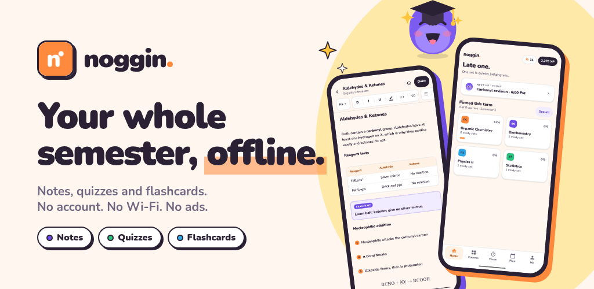
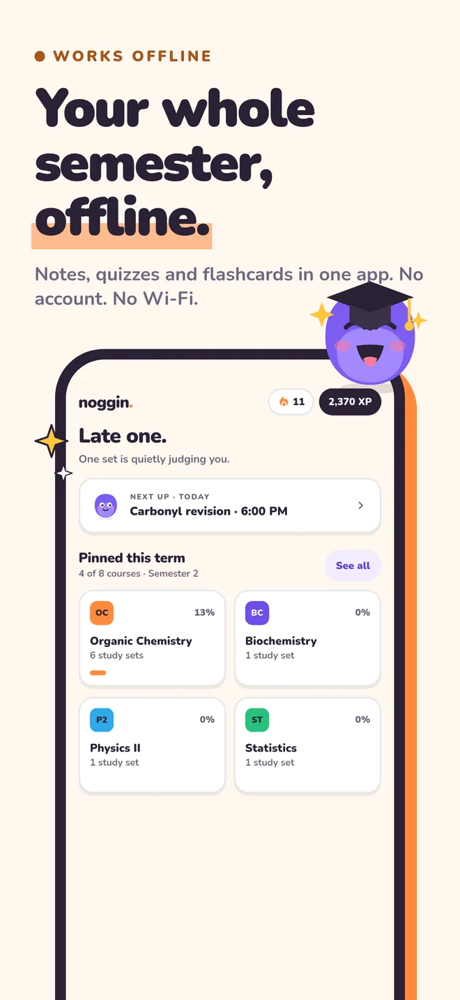
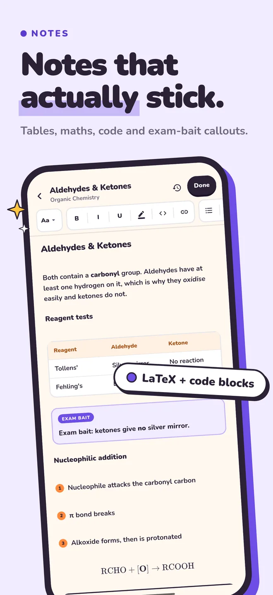
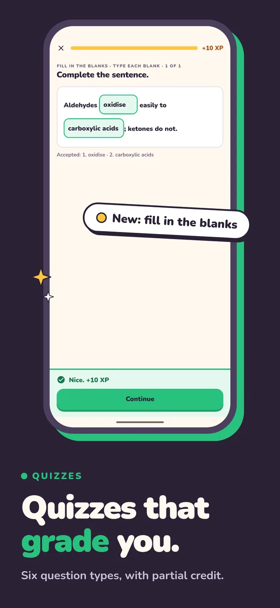
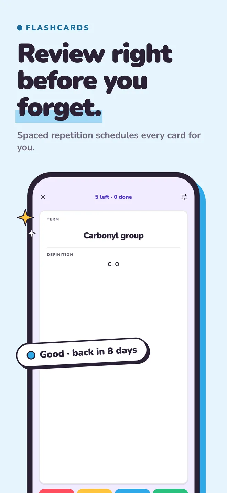

  

<h1 align="center">Noggin</h1>

  <b>Your whole semester, offline.</b> 
  Notes, quizzes and flashcards in one app. No account. No Wi-Fi. No ads.

  <a href="https://github.com/LandChit/Noggin-Page/releases/latest"><b>⬇ Download the latest version for Windows</b></a>
  &nbsp;·&nbsp;
  Android: coming soon to Google Play
   
  <a href="https://noggin.landchit.dev"><b>Test Android Early</b></a>

> Android Join Test Guide. Press "**Join the Closed Test**" on the site, join the Google Group, and install from the **link provided**.
---

## What is Noggin?

Noggin is a free study app for students. You make a course, add study sets to it, and every set comes with its own notes, quiz and flashcard deck. Write the material once and study it three ways.

Everything stays on your device. There's nothing to sign up for, and Noggin never needs the internet. It works the same on a train, in a lecture hall or on a plane.

  
  
  
  

## Features

### 📝 Notes that stick
A block editor built for lecture notes, with Markdown-style shortcuts if you like typing them.
- Headings, lists, quotes, tables, LaTeX maths and code blocks
- Callouts, including *exam bait* for the things your lecturer keeps hinting at
- Images from your gallery or files
- Bold, italic, underline, highlight, inline code and links

### ✅ Quizzes that grade you
Build a quiz from parts and mix the question types however you like.
- Multiple choice, identification, enumeration and ordered lists
- Matrix (fill the grid from a word bank) and fill in the blanks
- Partial answers get partial credit
- A review screen after every attempt

### 🃏 Flashcards that come back on time
Spaced repetition schedules every card, so you review it just before you'd forget.
- Rate each card Again, Hard, Good or Easy, and see when it comes back before you pick
- One daily review queue across all your courses
- Import Anki `.apkg` decks, or export your cards as `.apkg` or CSV

### 📅 Planner and exam mode
Exam in five days? Sorted.
- Classes, study blocks and exams in one calendar
- Import your class timetable from an `.ics` file
- A cram plan that puts your weakest topics first
- Exam mode takes over the home screen as the date gets close
- Optional reminders for study blocks, exams and due cards

### 🔥 Keep the streak alive
- XP for answers, reviews and focus time, and levels you never lose
- A daily goal and a streak, with freezes to bank for busy days
- Outfits for the mascot and badges to unlock
- A focus timer with rain, café, lo-fi and brown-noise sounds built in
- Night mode, a proper dark theme for late sessions

### 📦 Your files, your call
- **Backups:** save your whole library to one `.noggin` file and keep it wherever you like.
- **Share a set:** send a set, a course or several courses to a classmate as a `.noggin` file.
- **Import from text:** Noggin gives you instructions to paste into the AI chat you already use. Paste its answer back in and Noggin builds the notes, quiz and cards for you. Noggin itself never connects to the AI.

## Private by design

- **No account.** Open it and start.
- **No ads.** No banners, no pop-ups and no in-app purchases.
- **No tracking.** No analytics and no crash reporting. There's no server to send anything to.
- **Nothing leaves your device.** The Android app doesn't even ask for internet access.

## Download

| Platform | Get it | Needs |
|---|---|---|
| **Windows** | [Latest release](https://github.com/LandChit/Noggin-Page/releases/latest) (download the `.exe`) | Windows 10 or 11, 64-bit |
| **Android** | Coming soon to Google Play | Android 7.0 or later, phone or tablet |

The Windows installer doesn't need admin rights, and after installing you can open `.noggin` files by double-clicking them.

Noggin is free.
